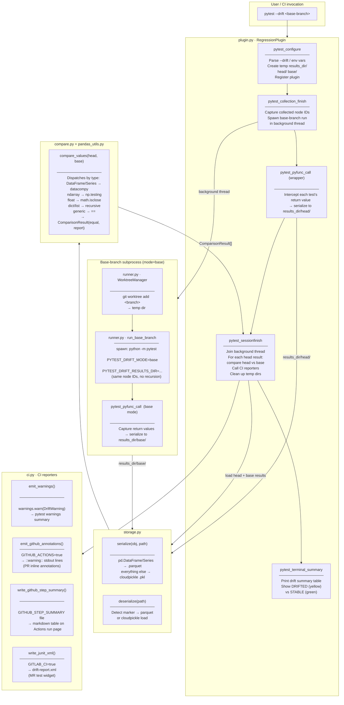

# pytest-drift Architecture

## Module overview

| Module | Responsibility |
|---|---|
| `plugin.py` | pytest hooks, orchestration, plugin registration |
| `runner.py` | git worktree management, base-branch subprocess |
| `storage.py` | serialize/deserialize test return values |
| `compare.py` | type-dispatching value comparison |
| `pandas_utils.py` | DataFrame/Series comparison, `ComparisonResult` dataclass |
| `report.py` | terminal diff formatting |
| `ci.py` | CI-specific reporters (warnings, GitHub Actions, GitLab CI) |

---

## Architecture diagram



---

## Runtime flow

```
pytest --drift main
        │
        ├─ [collection] ──────────────────────────────────────────────────────┐
        │   Collect all test node IDs                                          │ background thread
        │                                                                      ▼
        │                                                         git worktree add main /tmp/wt
        │                                                         python -m pytest (base mode)
        │                                                           └─ captures return values
        │                                                               → results_dir/base/
        │
        ├─ [test run] (HEAD)
        │   Each test runs normally.
        │   Wrapper intercepts return value → serialize → results_dir/head/
        │   Test pass/fail is UNCHANGED — drift doesn't affect it.
        │
        └─ [session finish]
            Join background thread (wait for base run)
            For each test with a head result:
              deserialize head + base → compare_values() → ComparisonResult
            ──────────────────────────────────────────────────────────────────
            CI reporters (non-failing):
              DriftWarning        → pytest warnings summary (universal)
              ::warning::         → GitHub PR annotations
              GITHUB_STEP_SUMMARY → markdown report on Actions run page
              drift-report.xml    → GitLab MR test widget
            ──────────────────────────────────────────────────────────────────
            Terminal: STABLE (green) / DRIFTED (yellow) per test
```

---

## Key design decisions

**Tests never fail due to drift.** The exit code is never modified. Drift is purely observational — it surfaces changed return values for review without blocking CI.

**Base branch runs in a throw-away git worktree.** `git worktree add` checks out the base branch into a temp directory without touching the working tree. It is cleaned up after the session regardless of outcome.

**Serialization is type-aware.** DataFrames and Series use Parquet (preserving dtypes); everything else uses cloudpickle. A small marker file (`__parquet__` / `__parquet_series__`) tells the deserializer which path to take.

**Comparison dispatches by type.** DataFrames go through datacompy (with positional fallback to `pd.testing`), numpy arrays through `np.testing`, floats through `math.isclose`, and dicts/lists recursively. This avoids false positives from floating-point noise.

**CI reporting is layered.** Each reporter is independent and fires only when its environment is detected, so the same plugin works locally, on GitHub Actions, and on GitLab CI without configuration.
